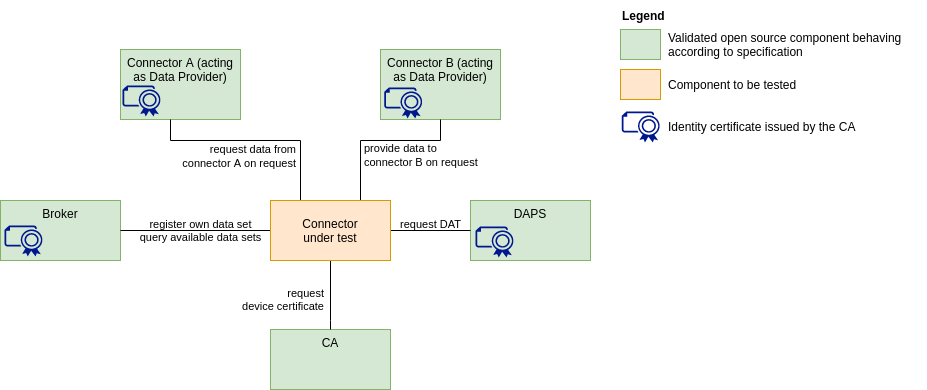

# IDS deployment on Kubernetes for FlexiGroBots-H2020 🚁🌽🌽🌽🚁

This repository are found the instructions to deploy an IDS system with Kubernetes. A brief description of these systems according to the [official site](https://internationaldataspaces.org/) is: *"A secure, sovereign system of data sharing in which all participants can realize the full value of their data"*. 

## Requirements

This section summarizes the hardware and software features used for the deployment. Note that the IDS is sensitive to traffic load and may require a more powerful hardware system if traffic increases.

### Software-requirements

- [Kubectl](https://kubernetes.io/es/docs/tasks/tools/) version:
  - Client Version: `v1.24.0`
  - Kustomize Version: `v4.5.4`
  - Server Version: `v1.24.0`
- [Kompose](https://kompose.io/)
  - `1.26.0`

- Cluster runs in [Docker-Desktop](https://docs.docker.com/desktop/windows/install/)
  - `v20.10.14`

-  [IDS-Release 1.0](https://github.com/International-Data-Spaces-Association/IDS-testbed)
-   OS Windows 10 Enterprise
    -   WSL2: Ubuntu 20.04 LTS
  
- OpenSSL `1.1.1f`

### Hardware-requirements
- 16 GB RAM memory
- Intel(R) Core(TM) i5-10310U CPU @ 1.70GHz   2.21 GHz

- 237 GB ROM memory

## Architecture

The following figure shows the proposed architecture. The image and the architecture is based on the next [repo](https://github.com/International-Data-Spaces-Association/IDS-testbed).

The main parts of the system are:
- 
-  [IDS connectors](https://international-data-spaces-association.github.io/DataspaceConnector/) have been used to develop the A and B connectors. IDS-connector sends data to a device or database in a certified and trusted data-space. Thus, the data-providers always have control over their data. 
  
- "Dynamic Attribute Provisioning Service" [DAPS](https://github.com/International-Data-Spaces-Association/IDS-G/blob/main/Components/IdentityProvider/DAPS/README.md) aims to verify and secure a set of attributes of organizations and connectors. In this way, third-parties need only need to rely on the DAPS assertions. This DAPS system uses Omejdn instances to perform the confirmations and store the certificates. 
  
- The IDS Metadata [Broker](https://github.com/International-Data-Spaces-Association/metadata-broker-open-core) is one of the modules still under development and intends to help IDSA members implement custom broker solutions.

  If broker image is not in the local machine it is neccesary to build the dockerfile. 

  ` docker build MetadataBroker/build .`

## Starting the architecture

- The first step is to created a namespace.
  
  `kubectl create namespace ids-2`
  

- To comunicate with the nginx-controller is neccesary to add the next lines in `/etc/hosts`.
  
    `127.0.0.1       connectora.localhost`
    
    `127.0.0.1       connectorb.localhost`

- For the ingress manifest is neccesary to create a secret. With the next command it is generate a cert and key file and a secret in the namespace.
  
    `openssl req -x509 -nodes -days 365 -newkey rsa:2048 -keyout tls.key -out tls.crt`

    `kubectl create secret tls tls-secret --key tls.key --cert tls.crt -n ids-2`

- The next step would be to launch the application manifests.

    `kubectl apply -f k8s/all -n ids-2`

- The last point would be to check that the deployment has been performed successfully. Using tools such as [K9s](https://k9scli.io/). The results might be as below. 
    

- Also it is neccesary to deploy an ingress manifest. For that, we have implemented two ways with two proxys (nginx and traefik). Nginx is more oriented to run in local machines whereas traefik can deploy the system in local and remote cluster. 

  To run with nginx, it is necessary to install Nginx driver to be able to make the calls to the cluster from the outside. If the Ingress-Nginx repo is not updated, in this [link](https://kubernetes.github.io/ingress-nginx/deploy/) the official documentation can be found.

    `kubectl apply -f https://raw.githubusercontent.com/kubernetes/ingress-nginx/controller-v1.2.0/deploy/static/provider/cloud/deploy.yaml`

  And finish deploying the ingress manifest with:
      
  `kubectl apply -f /k8s/Ingress/4-ingress-connection-nginx.yaml -n ids-2`

  On another hand, the official web defines traefik as :

  *"Traefik is an open-source Edge Router that makes publishing your services a fun and easy experience. It receives requests on behalf of your system and finds out which components are responsible for handling them."*
  
    

  Traefik can be deployed with the next manifests.

    `kubectl apply -f k8s/traefik/010-crd.yaml`
    
    `kubectl apply -f k8s/traefik/011-middleware.yaml`
    
    `kubectl apply -f k8s/traefik/015-rbac.yaml`
    
    `kubectl apply -f k8s/traefik/020-pvc.yaml`
    
    `kubectl apply -f k8s/traefik/030-deployment.yaml`
    
    `kubectl apply -f k8s/traefik/040-service.yaml`
    
    `kubectl apply -f k8s/traefik/055-ingressroute.yaml`

  To remove traefik menifests.

    `kubectl delete -f k8s/traefik .`

Finally, with a tool such as [Postman](https://www.postman.com/), a test could be performed to verify that the communication and connectivity of the infrastructure are correct. For this purpose, the [ids-certification-testing](TestbedPreconfiguration.postman_collection.json) file is used, in which a set of tests verifies the tool's proper operation on Kubernetes.

[KubeLinter](https://docs.kubelinter.io/#/) have been tested and modified to obtain standarized YAML manifests. Using the next command it is possible to test the manifests.

`kube-linter lint k8s/Services-Deployments --config k8s/Config-test/kube-linter-test.yaml`

These tests can be customized by changing the [file](k8s\Config-tests\kube-linter-test.yaml).

