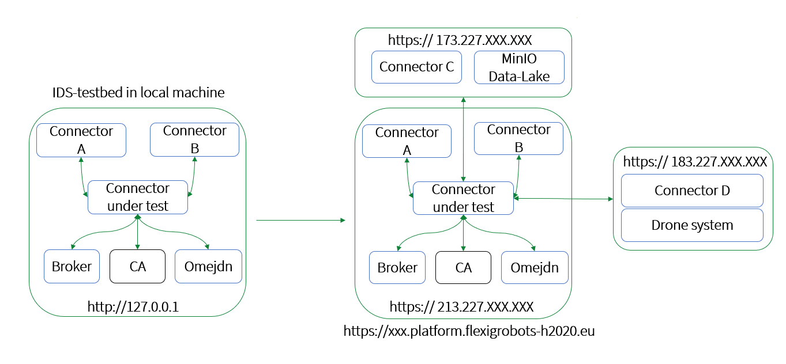
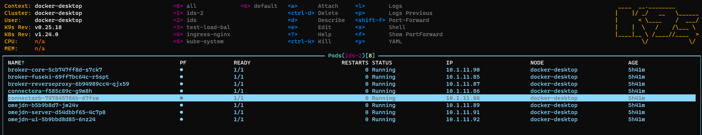
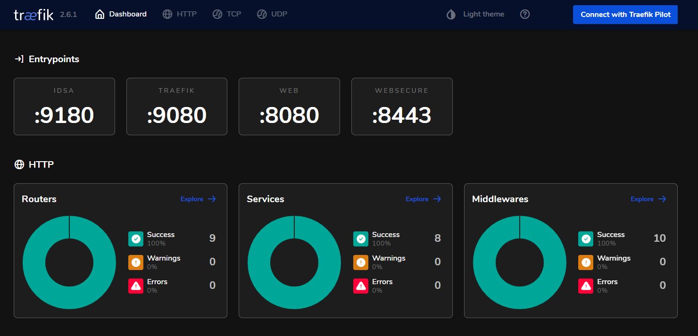

# IDS deployment on Kubernetes using an external connector for FlexiGroBots-H2020 wi 🚁🌽🌽🌽🚁

The IDS-testbed repository uses docker-compose technology to deploy a data-space with two connectors, but whether your goal is to deploy a data-space using K8S technology or it is to deploy a data-space in a production environment in a cloud cluster like Rancher or another. In the below image, we can see the main aim, where we move from a local system to a cloud system.

Before starting, a good way is to define what is data-space? and what is IDSA?

- The [link](https://gaia-x.eu/what-is-gaia-x/core-elements/data-spaces/) is referred a data-space as *"A type of data relationship between trusted partners who adhere to the same high level standards and guidelines in relation to data storage and sharing within one or many Vertical Ecosystems"*.

- And IDSA, could be defined using the [official site](https://internationaldataspaces.org/) as: *"A secure, sovereign system of data sharing in which all participants can realize the full value of their data"*. 

## Requirements to run in a local machine. 

Firstly, we developed the system on a local machine, our development PC has installed *Kubectl* and *Docker-Desktop*, the software specifications are below in the next subsection. We used *Docker-Desktop* because by default there is installed a k8s cluster. 

The system was running with a windows OS using WSL V2.0 with an Ubuntu 20.04 LTS.

### Software-requirements

- [Kubectl](https://kubernetes.io/es/docs/tasks/tools/) version:
  - Client Version: `v1.24.0`
  - Kustomize Version: `v4.5.4`
  - Server Version: `v1.24.0`
- [Kompose](https://kompose.io/)
  - `1.26.0`

- Cluster runs in [Docker-Desktop](https://docs.docker.com/desktop/windows/install/)
  - `v20.10.14`

-  [IDS-Release 1.0](https://github.com/International-Data-Spaces-Association/IDS-testbed)
-   OS Windows 10 Enterprise
    -   WSL2: Ubuntu 20.04 LTS
  
- OpenSSL `1.1.1f`

Respect the hardware-requirements the PC used was a laptop with a medium performance. The technical characteristics are below.

### Hardware-requirements
- 16 GB RAM memory
- Intel(R) Core(TM) i5-10310U CPU @ 1.70GHz   2.21 GHz

- 237 GB ROM memory

## Architecture

The [repo](https://github.com/International-Data-Spaces-Association/IDS-testbed) proposes to deploy an architecture as shown below. This data-space is formed for two *internal connectors*, a *broker set* and *omejdn set*. 

The function of each part is explained below:
  
  -  [IDS connectors](https://international-data-spaces-association.github.io/DataspaceConnector/) have been used to develop the A and B connectors. IDS-connector sends data to a device or database in a certified and trusted data-space. Thus, the data-providers always have control over their data. 
  
  - "Dynamic Attribute Provisioning Service" [DAPS](https://github.com/International-Data-Spaces-Association/IDS-G/blob/main/Components/IdentityProvider/DAPS/README.md) aims to verify and secure a set of attributes of organizations and connectors. In this way, third-parties need only need to rely on the DAPS assertions. This DAPS system uses Omejdn instances to perform the confirmations and store the certificates. 
  
  - The IDS Metadata [Broker](https://github.com/International-Data-Spaces-Association/metadata-broker-open-core) is one of the modules still under development and intends to help IDSA members implement custom broker solutions.

We use the IDS-testbed repository, but it is possible to create the same data-space using each part from their particular repository. But, it is necessary to configure the networks and the certifications to run correctly.

  If broker image is not available in the local machine it is neccesary to build the dockerfile. 

  ` docker build MetadataBroker/build .`

## IDS deployment in K8S in a Local machine.

When we work in a cluster is important to have a clean environment, for this reason, we recommend creating a namespace for the data-space. 

- The easiest way to create a namespace is using the next command. In this case, ids-2 is the name of the namespace. 
  
  `kubectl create namespace ids-2`
  

- When we work on a local PC we can assign an URL to localhost IP. In the  `/etc/hosts` file it is possible to configure that characteristic. 
  
  `127.0.0.1       connectora.localhost`
    
  `127.0.0.1       connectorb.localhost`

- One of the hard points of IDSA is security, for this reason, it is necessary to create a set of certificates.
  
  `openssl req -x509 -nodes -days 365 -newkey rsa:2048 -keyout tls.key -out tls.crt`

- After the certificates have been created the next step is to use these certificates. The best way to use certificates in K8S is by secret. The fastest way to create a secret is using the below sell command.

  `kubectl create secret tls tls-secret --key tls.key --cert tls.crt -n ids-2`

- The idsa_manifest_local folder is divided into several folders, each folder corresponding to each component. Also, there is a folder with the proxy and another with the ingress. Finally, to create a component in the cluster you can use the above command, being, ".MANIFEST_NAME" the YAML name that describes the component.
    
    `kubectl apply -f .MANIFEST_NAME.yaml -n ids-2`

- It is recommended to use a visualization tool like [K9s](https://k9scli.io/), with this type of software you can check the correct performance of each component. 
    

- Respect the ingress manifest, in this repository we have deployed two ways with two technologies (Nginx and Traefik). Nginx is easier to configure but when we work in a remote cluster in rancher is more difficult to configure and more unstable. For this reason, we propose another solution, Traefik. This proxy is more flexible and modern than Nginx, in addition, Traefik includes a dashboard that help us with the system deployment. 

  - To run with nginx , it is necessary to install Nginx driver to be able to make the calls to the cluster from the outside. If the Ingress-Nginx repo is not updated, in this [link](https://kubernetes.github.io/ingress-nginx/deploy/) the official documentation can be found.

    `kubectl apply -f https://raw.githubusercontent.com/kubernetes/ingress-nginx/controller-v1.2.0/deploy/static/provider/cloud/deploy.yaml`

    And finish deploying the ingress manifest with:
      
    `kubectl apply -f ./Ingress/4-ingress-connection-nginx.yaml -n ids-2`

  - On another hand, the official web defines traefik as  :

    *"Traefik is an open-source Edge Router that makes publishing your services a fun and easy experience. It receives requests on behalf of your system and finds out which components are responsible for handling them."*
  

    Traefik can be deployed with the next manifests (the order to deploy is important).

    `kubectl apply -f ./traefik/010-crd.yaml`

    `kubectl apply -f ./traefik/015-rbac.yaml`
    
    `kubectl apply -f ./traefik/011-middleware.yaml`
        
    `kubectl apply -f ./traefik/020-pvc.yaml`
    
    `kubectl apply -f ./traefik/030-deployment.yaml`
    
    `kubectl apply -f ./traefik/040-service.yaml`

    In addition, Traefik allows deploying a dashboard to track the health of the proxy and their cluster modules connections. To deploy this element you can use the next command.

    `kubectl apply .f ./trafik/Traefik-Dashboard/4-ingress-dashboard-https-local`

        
  The appearance of this Traefik dashboard is shown below.
  

  Likewise, we deployed an Ingress manifest with Nginx, with Traefik requiring a similar Ingress manifest. But also, It is necessary to create a TCP layer transport, being a Traefik specific component. 
  The IngressRouetes folder contains all components to deploy either [local](./traefik/IngressRoutes/4-ingressroute-local.yaml) or in the [cloud](./traefik/IngressRoutes/4-ingressroute-rancher.yaml)
  

    `kubectl apply -f ./IngressRoutes/4-ingressroute-local.yaml`
    
  To remove traefik menifests.

    `kubectl delete -f ./traefik/`

    `kubectl delete -f ./traefik/IngressRoutes/`

    `kubectl delete -f ./traefik/Traefik-Dashboard/`

Finally, with a tool like [Postman](https://www.postman.com/) it is possible to test our IDS-testbed. Firstly, we can check the communication with the connector. After that, we try to register our connector to the data-space, and we will make sure that the connection is successful with the IDS. For this purpose,  [ids-certification-testing](TestbedPreconfiguration.postman_collection.json) file is used, in which a set of tests verifies the tool's proper operation on Kubernetes.

<!-- 
[KubeLinter](https://docs.kubelinter.io/#/) has been tested and modified to obtain standardized YAML manifests. Using the next command it is possible to test the manifests.

`kube-linter lint k8s/Services-Deployments --config k8s/Config-test/kube-linter-test.yaml`

These tests can be customized by changing the [file](k8s\Config-tests\kube-linter-test.yaml). -->

## IDS deployment in K8S in a cloud machine with an external connector

The steps to deploy in a remote cluster are the same as in local. The only thing that needs to be changed is some configuration.

Traefik proxy is deployed the same as in the local example. The only difference is that for the dashboard, it is necessary to deploy the[4-ingress-dashboard-https-rancher.yaml](./traefik/Traefik-Dashboard/4-ingress-dashboard-https-rancher.yaml), to have a public domain. In this case, the domain is linked to the URL of the European FlexiGroBots project. In addition, it is also necessary to deploy the Ingress resource corresponding to the cluster,[4-ingressroute-rancher.yaml](./traefik/IngressRoutes/4-ingressroute-rancher.yaml).

Despues de esto hay que desplegar los manifiestos que se encuentran en la carpeta [idsa_manifests_rancher](./idsa_manifest_local/). Dentro de esta carpeta se encuentran los modulos que forman el DataSpace configurados para trabajar de manera remota. 

 It is necessary to configure two parts in this stage. The first one is to make public the Omejdn and the Broker-Core-Proxy of our Data-Space. 

To make public the Omejdn and Broker-core-proxy it is necessary to create an ingress for each component. For the first ingress we use an URL (omejd-idsa.platform.flexigrobots-h2020.eu) to make public the pod, in this case, this ingress has to open the 80 port and it has to attack Omejdn service. Respect the Broker-proxy is the same, it is necessary to create an ingress manifest with the 443 port open. Also, we have added a public URL (broker-reverseproxy.platform.flexigrobots-h2020.eu)

After configuring the way to access Omejdn and broker. There are some parameters that it is necessary to configure them. In particular:
- DAPS_VALIDATE_INCOMING: in the Broker-Core, we change this value from True to False
- OMEJDN_ISSUER: in the omejdn_server, we change the value of OMEJDN_ISSUER from http:/omejdn/auth to http://omejd-idsa.platform.flexigrobots-h2020.eu/auth
- OMEJDN_DOMAIN: the next value is in Omejdn deployment. And we modify http://omejdn to http://omejd-idsa.platform.flexigrobots-h2020.eu
- OMEJDN_ISSUER:  the last variable is the Omejdn-UI. We have changed OIDC_ISSUER to http://omejd-idsa.platform.flexigrobots-h2020.eu

Finally, to deploy the connector, it is necessary to configure some variables of the connector so it can connect well. All the configuration is in the [docker-compose.yaml](./External_connector/docker-compose.yml), where the port, the DAPS_URL, the DAPS_token and the DAPS_KEY_URL are defined, also the Omejdn address must be added to the whitelist of the port for it to work correctly. 